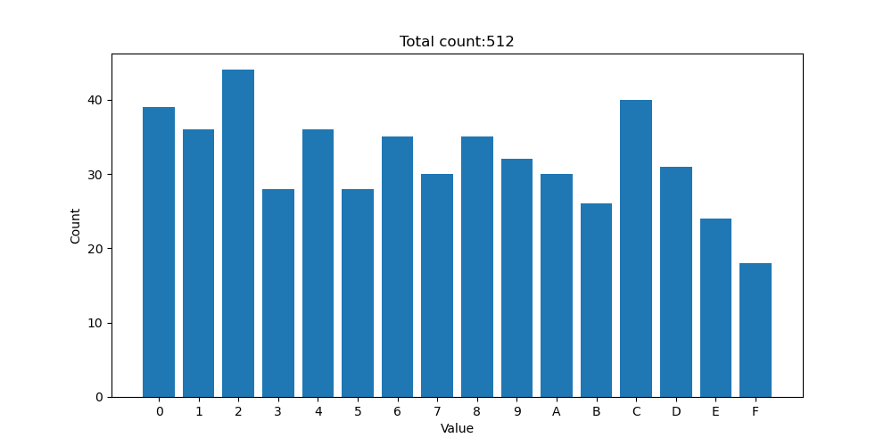
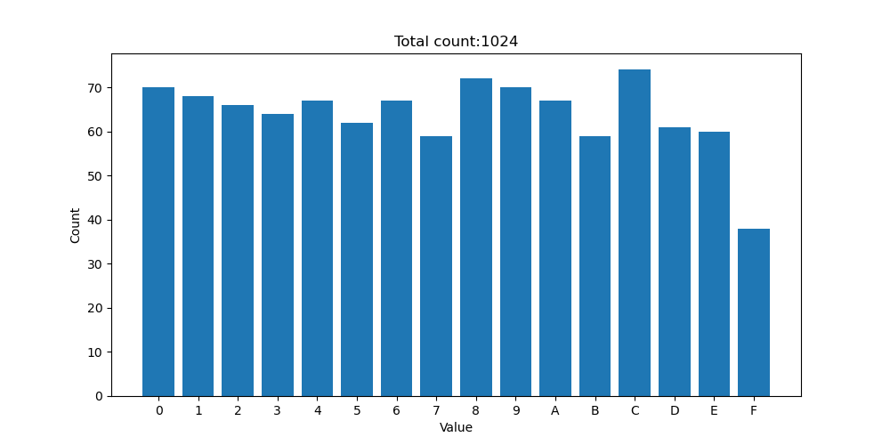
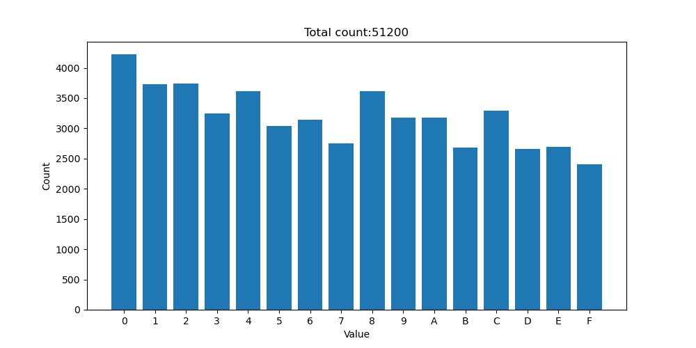

# CA-hash 🛡️
**Experimental hash function** based on the non-reversible **C**ellular **A**utomata [*Game of Life*](https://en.wikipedia.org/wiki/Conway%27s_Game_of_Life)

Implementation of Game Of Life [here](https://github.com/antoniopelusi/game-of-life-CLI)!

## Parameters

- **hash_length**: the length of the final hash (*default: ```512```*), if ```0```: get the full size hash

- **iter**: number of the Game of Life iterations applied to the initial grid (*default: ```5```*)

- **grid_size**: size of the grid used to apply Game of Life iterations (*default: ```128```*)

- **print_grid**: if *```True```*: print the initial grid and final grid to terminal (*default: ```False```*)

## Usage information

- this hash function do not use any external library apart from *numpy* for the generation of the random grid

- the Game of Life is non-reversible (there are multiple 
pre-configurations for every grid configuration)

- change the **mode** variable to switch from the two modes:

    - *hash mode*: generate the hash text
    
    - *bias_test mode*: test the bias of the hexadecimal values of the hash (is possible to change the *n_iteration* variable to test more hashes in a row)

## Steps

1. generate the key converting the input string into a list of the input characters econded in *utf-8*

1. create the random grid using the key as seed

1. execute the non-reversible Game of Life iterations on the grid

1. linearize the matrix in a string of bits

1. remove any string of 5 consecutive zeros (```00000```) string from the string of bits to decrease the ```0```/```1``` bias

1. shuffle the string of bits

1. convert groups of 4 binary bits into hexadecimal values

1. shuffle the string of hexadecimal values

1. trim the string of hexadecimal values to the desired size

1. return the final hash

## Tests

The **CA-hash** function has some bias, caused by the bias in ```0```'s and ```1```'s in Game Of Life.

To decrease this bias, every string of 5 consecutive zeros (```00000```) will be removed from the linearized matrix.

>**Input:** ```"test"```
>
>**Hash length:** ```512```
>
>**Number of Game Of Life iterations:** ```5```
>
>**Grid size:** ```128```
>
>

>**Input:** ```"test"```
>
>**Hash length:** ```1024```
>
>**Number of Game Of Life iterations:** ```5```
>
>**Grid size:** ```128```
>
>

>**Input:** ```Numerical range from 0 to 99```
>
>**Hash length:** ```512```
>
>**Number of Game Of Life iterations:** ```5```
>
>**Grid size:** ```128```
>
>

>**Input:** ```Numerical range from 0 to 99```
>
>**Hash length:** ```1024```
>
>**Number of Game Of Life iterations:** ```5```
>
>**Grid size:** ```128```
>
>
